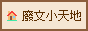
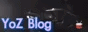

> [!WARNING] Notice
> This post is a draft translation from [the Chinese version](/blog/zh/blogroll/) which have not yet been thoroughly proofread.

其實嘛，這篇部格卷除了少數例外，跟 Wiwi 部落格宇宙的內容沒什麼分別。
{.hovers-blur}

# 有過直接交流的部落格
| 名稱 | 連結 | 備註 |
| -- | -- | -- |
| Wiwi.Blog | https://wiwi.blog | [BlogBlog 同樂會](https://blogblog.club/party)發起人。 |
| 資工小廢物 - JN  | https://blog.giveanornot.com | [BlogBlog 同樂會](https://blogblog.club/party)搶頭香常客、候任主持人之一。 |
| Wen 的生產力實驗室 | https://www.wen-lab.tw | [BlogBlog 同樂會](https://blogblog.club/party)主持人之一。 |
| 廢文小天地  | https://trashposts.com |  |
| YoZ Blog  | https://www.yozblog.com | [BlogBlog 同樂會](https://blogblog.club/party)主持人之一。 |
<!--| Alex Hsu 斜槓少年 | https://alexhsu.com | [BlogBlog 同樂會](https://blogblog.club/party)主持人之一。 |-->

# 其他推介
| 名稱 | 連結 | 備註 |
| -- | -- | -- |
| Shuo-jen Blog  | https://shuojen.com |  |
| Ivon 的部落格 | https://ivonblog.com | <!--有 NSFW 內容。--> |
| LQ7 的創作與想像 | https://lq7.tw |  |
| Eddie Lv | https://eddielv.com | [BlogBlog 同樂會](https://blogblog.club/party)主持人之一。 |
| Matrix67: The Aha Moments | https://matrix67.com/blog/ | 有許多硬核的數學內容。（簡體中文） |
<!--|  | https://ble-m.ltgc.cc | 英語 |-->

<!--
# 異端
以下是一些我覺得內容有參考價值，但可能會被 Wiwi 部落格宇宙視為「異端」的網站：

| 名稱 | 連結 | 備註 |
| -- | -- | -- |
|  |  |  |
-->
