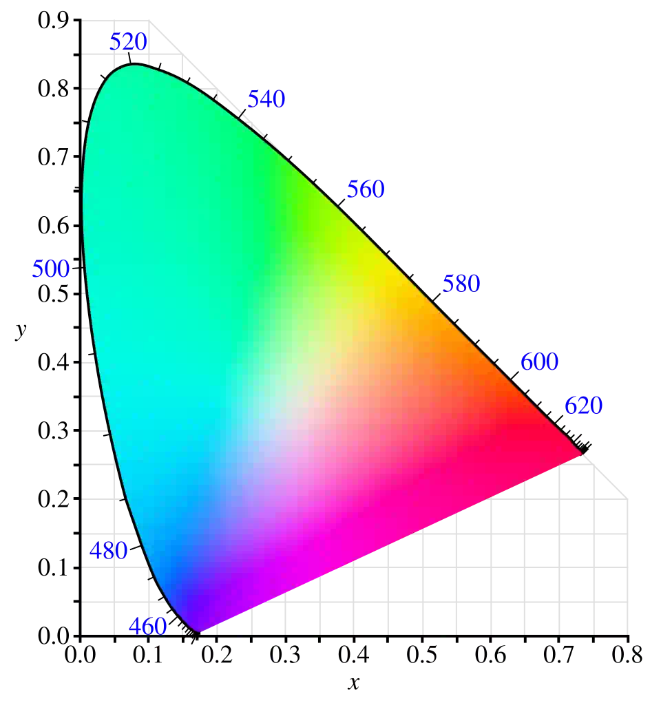
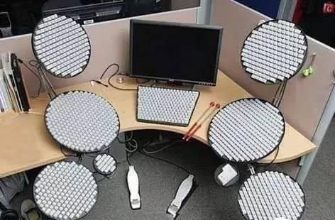

> [!WARNING] Notice
> 呢篇文章暫時仲未粵語化，暫時拎住[書面語版本](/blog/zh/fun-facts/)頂住檔先。我遲啲有時間會更新返粵語版本！

> [!TIP] BlogBlog 同樂會！
> 呢篇係我嘅「[BlogBlog 同樂會 - 2026 年 7 月](https://blogblog.club/party)」嘅投稿文章。今個月嘅主題係「[有趣的小知識或冷門概念](https://shuaixin.cc/Fun-Fact/)」，由[劉昕](https://shuaixin.cc)主持。如果你有自己嘅部落格，歡迎一起嚟參加！

> [!CAUTION] 警告
>
> 本文有部份論點較為激進，擔心閱讀後玻璃心碎滿地者，請自行斟酌是否繼續閱讀。

> [!WARNING] 注意
> 不知道為什麼圖片總是顯示不出來，故暫時改以超連結方式展示。

# 恐龍其實還沒有完全滅絕
鳥類與某些恐龍品種之間的聯繫，其實比另一些恐龍品種之間的聯繫都還要接近。因此恐龍其實還沒有完全滅絕，鳥類是名符其實的現代恐龍。

# 顏色的含義

[色度圖。](/blog/2245f3ec-a441-4c37-8c2e-790ce102f24e.webp)

顏色其實並沒有任何物理含義，它只是生物的一種視覺感受而已。真正有物理含義的，是電磁波的光譜。

HSV/HSL 色彩空間當中的色相（hue）色相環單位是角度，這種色相環的角度也沒有什麼物理意義。大多數人類能感知到的顏色，實際上是一個不規則的曲面立體，色相環是對這種不規則圖形的一種閹割。色度圖（chromaticity diagram）也是個不規則的圖形，上面的 X 軸和 Y 軸也不具備物理意義，它就純粹是個數學工具而已。

「白色」在物理上沒有一個清晰、統一的定義，每個色彩空間都需要自己去定義一個「白點」（white point），所以大家玩攝影時還有白平衡調整這種破事。

# BlogBlog 同樂會宇宙的二三事
因為<ruby><rb>大人的理由</rb><rp>（</rp><rt>有人玻璃心碎了</rt><rp>）</rp></ruby>拆成獨立文章了，詳請[點此](/blog/zh/a-few-things-about-the-blogblog-universe)。

# 八成飽
> 鋰電池充到八成飽就好，對電池會更健康喔！

既然如此，為什麼手機的電量標示不把 80% 滿的電量直接標成 100%？這麼做在心理學上不會對用戶更少負擔嗎？

# 虛擬世界論與宗教
如果這個世界真的是被[虛擬](https://zh.wikipedia.org/wiki/%E6%A8%A1%E6%93%AC%E7%90%86%E8%AB%96)出來的話，那麼在這個虛擬世界之外的觀察者，就可以理解為虛擬世界內部的人所解的「神」。這些「神」究竟是有一位還是多位，對於虛擬世界內部的人而言根本無法區分。所以在這個世界內部討論世界到底是一神還是多神是毫無意義的。

也許你會說：「且慢！」，然後說，那是人類難以企及的領域，所以所謂一神或者多神可以看作是人類的藝術加工，然後慢慢形成一種信仰。……

(WIP)

# 「得」的歧義
在現代標準漢語[^1]中，「[得](https://dict.revised.moe.edu.tw/dictView.jsp?ID=1923)」字有好幾個不同的讀音：
- ㄉㄜˊ dé：
    - 表示「能夠」。如「不得」、「得以」。
    - 不屬於下列義項的一切其他義項。
- ㄉㄟˇ děi：表示「必須」。
- ˙ㄉㄜ de：用於動詞、形容詞後面，表示狀語。

台灣的法律條文很喜歡用「得」字，讀作ㄉㄜˊ dé，表示「能夠」的意思。表「必須」之義時，用「應」。在粵語的書面語讀法中，「得」字的所有義項都唸成同音，於是就產生歧義了（但「得」表「能夠」義很少獨用，通常與「不」連用），是台灣法律用語中一個臭名昭著的大坑。

# 人均林超英
> 熱，但不辛苦。
>
> ——林超英

香港有一位以堅持不開冷氣而著稱的人物，名叫林超英。每逢炎夏，總會有一批熱心網民關心其有否破戒或中暑。叉雞有做過一條[影片](https://youtu.be/ws2Rfw7CrHw)講述他的事跡。

根據身邊人的描述[^2]，台灣和大陸的冷氣水平，相較於香港而言都很弱。因此這些地方的人都是人均林超英。（恭喜 Wiwi 成為[例外](https://wiwi.blog/blog/twenty-fived)！）

據說歐洲那邊有很多人寧願熱死也不裝冷氣（直至真的熱死了才想起來這件事），這些人的觀點與上述描述別無二致。

話說回來，冷氣其實是一個難以解開的惡性循環：冷氣將熱量帶到沒有冷氣的地方，從而致使更多的人都不得不打開冷氣。問題的解方只有一個，就是**先解決地球人口過多的問題。**

# 出世與還俗
> 另 110 年及 111 年變更姓名人數大幅成長，係因宗教因素出世或還俗所致。
>
> ——內政部《[全國姓名統計分析](https://www.ris.gov.tw/documents/data/5/2/112namestat.pdf)》，77 頁

此項描述和對應的時間點，很難令人不聯想到「鮭魚之亂」。但此項論述是否真的跟「鮭魚之亂」有關？我懶得深究下去了。

# 姓名法規
說起更改姓名這回事，我順便想比較一下不同地方的姓名法規。如果你是台灣人，一般而言一生人最多只能改三次名字，不過原則姓名長度並無字數限制（實務上的字數限制也是極其寬容的）。只是台灣有簽名時用中文全名的習慣，中文名起太長的話要簽名的時候會很麻煩。如果你是香港人，改名的次數原則上是沒有任何限制的，不過一般來說中文名最長只能取到六個字，而且改名的行政費用也比較貴。

另外在香港，更改「姓氏」基本上也是沒有任何限制的，就連新生兒取名也不強制一定要跟父母其中一方的姓（也許是因為有些南亞裔根本沒有嚴格意義上的姓氏），這種對「更改姓氏」的寬容度，和世界上很多司法管轄區相比，也是極其寬容的。

話說在台灣有人要求過「原住民族名去漢字化」，如果這事發生在香港其實會比較好辦。因為香港的法律允許一個人只有英文名而無中文名，不過反過來只有中文沒有英文不行。唯二的限制是長度限制，以及帶有 diacritics 的字母下不了香港身份證。

在台灣，在申請護照之前，你姓名的羅馬字拼法，似乎都是未確定的。不像香港在出生登記的時候，就已經確定名字的羅馬字拼法了。有一點在台港之間是一樣的，就是姓名羅馬字沒有要求所有人統一使用特定的拼音系統，也容許姓氏和名字使用不同的拼音系統。

# 簡化字姓氏？
曾經有人問過我，簡體中文的「庄」姓，在轉化成繁體時應該怎麼寫。我回答說：「到底是姓「莊」還是姓「庄」？這恐怕沒有人知道。」至少在香港[^3]和台灣的法律層面而言，「莊」和「庄」是兩個不同的姓氏。

另外我曾經看過有人在簡體中文環境下如此說：來自中文的「叶」姓應該讀作ㄧㄝˋ yè，而來自日文的「叶」姓應該讀作ㄒㄧㄝˊ xié。但其實在香港和台灣的法律層面而言，「葉」和「叶」也是被視作兩個不同的姓氏。那到底來自繁體中文的「叶」姓應當如何發音？我從私人機構的人名數據中可以看到，在香港被登記作「叶」姓的人名，羅馬字基本上都寫成「Yip」或者「Ye」，也就是當作「葉」來唸。這也是香港大多數普通人實際上的唸法。但這是否就是語源、文字學上正確的唸法？我也不知道。大多數普通人的唸法有可能被簡化字誤導了。

另外也有「肖」姓，據說大多數（但可能不是全部）的「肖」姓實際上是從「蕭」姓來的[^4]，而且主要來源也是來自中國大陸的新移民。「肖」和「蕭」在粵語發音上相差較大，到底「肖」姓在香港粵語裏通常被怎麼唸？我這個~~有點老~~的香港人反而不太清楚。[^5]

# 誤導性聲旁
簡化漢字有一些聲旁，並不完全依據現代標準漢語[^1]發音，於是乎這些字對於使用簡化漢字的普通話學習者來說，反而成了一種誤導。以下是一些例子：

- 進 → 进：井 ㄐㄧㄥˇ jǐng、進 ㄐㄧㄣˋ jìn
- 鄰 → 邻：令 ㄌㄧㄥˋ lìng、鄰 ㄌㄧㄣˊ lín
- 憐 → 怜：令 ㄌㄧㄥˋ lìng、憐 ㄌㄧㄢˊ lián

# 繁體中文鍵盤與中文輸入法

[爵士鼓中文鍵盤。](/blog/ad562cec-5bec-4511-8826-50ff83dc5c62.jpg)

有不少資料均指出香港最多人使用的輸入法是倉頡，在數十年前這也許是正確的，但其實現在已經不太對了。雖然很多中小學直到現在仍然會教倉頡，但事實上已經沒多少人能完全學會了。許多人用的實際上是速成（倉頡的簡化版），甚至是基於官話的漢語拼音和手寫辨識。

在香港賣的繁體中文鍵盤，其實跟台灣的繁體中文鍵盤沒有分別，大部分都有標示~~精靈文~~注音符號。此外還有倉頡和港台都沒什麼人在用的[大易](https://zh.wikipedia.org/wiki/%E5%A4%A7%E6%98%93%E8%BC%B8%E5%85%A5%E6%B3%95)。

大易在繁體中文鍵盤上面是個尷尬的存在，它有些鍵名和倉頡的相同但位置不同，容易成倉頡系輸入法初學者的混淆。大易實際的使用人口也極其稀少。與倉頡相比，大易會用到鍵盤上排的數字根（以及旁邊的一些符號鍵）來組字根，範圍跟注音差不多，重碼率卻高出一截。大易選字的方式也比較奇怪，是按你鍵盤上的「號路街鄉鎮」鍵而不是按數字鍵。據說以前台灣有一些專門的打字訓練會用上大易，除此之外基本上沒有人會用。正正是由於使用大易的人太少，有一些中文鍵盤其實已經索性去掉大易字根了（但是留下注音和倉頡，不然就不是中文鍵盤了）。

再往下講，就過於詳細、小眾了。我還是單獨開個[文章分類](/blog/zh/categories/chinese-ime-%E4%B8%AD%E6%96%87%E8%BC%B8%E5%85%A5%E6%B3%95/)吧。

# 其他語言鍵盤

[「QWERBY」鍵盤，一個不是很常見的鍵盤佈局。](/blog/62f07d49-2fef-4c64-86eb-a06fc4aac716.jpg)

你以為拉丁字母輸入法就只有 [QWERTY](https://zh.wikipedia.org/wiki/QWERTY%E9%8D%B5%E7%9B%A4) 一種？錯了！德語系用的是「[QWERTZ](https://zh.wikipedia.org/wiki/QWERTZ%E9%8D%B5%E7%9B%A4)」（唯一差別是「Y」和「Z」對調）、法語系用的是「[AZERTY](https://zh.wikipedia.org/wiki/AZERTY%E9%8D%B5%E7%9B%A4)」（「A」與「Q」對調、「W」與「Z」對調，右下角的「M」跟一些符號鍵被完全重組）。還有些非主流的鍵盤佈局如 [Dvorak](https://zh.wikipedia.org/wiki/%E5%BE%B7%E6%B2%83%E5%A4%8F%E5%85%8B%E9%8D%B5%E7%9B%A4)，非主流鍵盤佈局往往聲稱其設計更符合人體工學。

以泰文和印度文字為代表的「[婆羅米系文字](https://zh.wikipedia.org/wiki/%E5%A9%86%E7%BD%97%E7%B1%B3%E7%B3%BB%E6%96%87%E5%AD%97)」，由於字母數目太多，本身又不區分大小寫，所以 Shift 鍵被用於選擇字母。按下 Shift 鍵後的字母和對應不按 Shift 的字母可以毫無聯繫，純粹就是兩排不同的按鍵而已。

# 農曆節日
日本的許多節日都是從農曆日期直接搬到公曆日期慶祝，所以實際上是前移了一個多月。想當年 1930 年代的國民政府也有試圖命令廢除農曆新年，並模仿日本將新年習俗前移，但這項政策在民間遇到很大阻力，最後政府也是迫於無奈放棄。鬼也想不通這項政策在日本是怎麼被接受的。

# 兩個加號、兩個減號
程式語言 Python、Lua 和 Rust 的共同特點是什麼？就是都不支持 `++` 和 `--` 的運算子！好像程式員沒什麼人會特地把這個共同特點一同提到，但是程式員把這點記起來還是挺有用的。

順帶一提，Lua 不能用 `+=`、`-=` 之類一個運算子接一個等號的「運算 + 賦值」二合一運算子，只能寫成 `a = a + 1` 之類的形式。Python 和 Rust 就沒這個限制，`+= -= *= /= %= &= |= ^= <<= >>=` 隨便用。

# 文字書寫方向
地球上現存的大多數文字系統都是由左至右橫向書寫的，據說這是對右撇子最順手的書寫方向。

不過在遠古時期的歐洲，在文字徹底定型之前，不乏從右到左寫或者混合方向書寫的文字。這些文字系統和中東的文字系統（包括現今仍在活躍使用的希伯來字母與阿拉伯字母）同出一源，歐洲文字的書寫方向到底是怎麼反過來的確實耐人尋味。有一種理論認為，對於右撇子而言，在石頭上刻字的時候從右到左更順手，而用筆墨書寫時候從左到右更順手。所以是書寫工具和媒介的改變促成了文字書寫方向的轉變。至於為什麼中東的文字書寫方向沒反過來，可能是因為在書寫工具轉變的時候，這些文字已經宗教化了。

至於古代中國，則以縱書居多。但是在甲骨文中，文字既可以從左到右換行，也可以從右到左換行，後來才定型成從右到左換行。不過耐人尋味的是，從右到左換行的書寫模式，對於右撇子來說不是會更容易讓手部沾到剛寫好的墨水嗎？也許這就是[中國書法](/blog/zh/chinese-calligraphy/)強調反人體工學的「懸腕懸肘」的理由。

古埃及文字的書寫方向極為靈活，既可以縱書也可以橫書，既可以從左到右換行也可以從右到左換行，人、神明和各種動物的頭部會面向文字開始的方向。有時候一大段文字會混合使用不同的書寫方向，例如從中間往左右擴散形成左右對稱的格局，或是和插畫中各種人和神明的面向對齊。現代文獻為了配合西方文字的排版，一般從左到右橫書，但從古時候的實物來看，預設的書寫方向似乎是從右到左縱書。後來世俗體雖然是用筆墨寫的，但是卻固定成了從右到左橫書。

楔形文字最早期其實是縱書的，後來不知道怎麼逆時針轉了 90 度，定型成了從左到右橫書。至於古代美洲文字的書寫方向就更複雜了，本文就不展開講了。

# 電梯門的安慰劑按鈕
舊文，詳請[點此](/blog/zh/placebo-button/)。

# 淺談數個漢語方言現象
啊，剛好找到篇舊文，順便也拿來投稿了，詳請[點此](/blog/zh/chinese-dialectal-phenomena/)。

# 關於本站
這個網站的不少界面元素都是從「Wiwi 部落格宇宙」當中別的部落格~~抄~~參考而來的，都是反向工程，全程盡量不依靠 AI，算是我給自己的一個小小挑戰。

[^1]: 「現代標準漢語」是個學術名詞，常見的稱呼有「普通話」、「國語」和「華語」等，但很遺憾地這種語言並不存在一種獲得普遍使用、無歧義、而且能夠使某些政治狂熱份子滿意的稱呼，不管我怎樣稱呼都總會有人不滿意。
[^2]: 我本人因為不喜歡在大夏天外出，所以基本上也沒有在夏季拜訪過這些地方。
[^3]: 香港政府似乎未有發佈有關香港人姓氏的分佈數據，我只好從私人機構的人名數據得出本文中的某些結論。對於「某姓氏於香港是否罕見」，我目前也只能靠印象給出一個大略的推斷。
[^4]: 「肖」在一段時間曾經被用作「蕭」的簡化字，後來又撤回了，但在戶政記錄上已經改不回去了。
[^5]: 其他的簡化字姓氏例子包括但不限於「付傅」、「鍾鐘」、「閻閆」、「詹占」、「范範」等，不過在粵語發音剛好不會構成顯着差別，我也就沒有展開來講。「藍蘭」粵語發音有細微差別（但唸錯了口音會很明顯），「戴代」粵語發音也是差很遠，但我暫時未見過有登記為「蘭」姓、「代」姓的香港人口。
