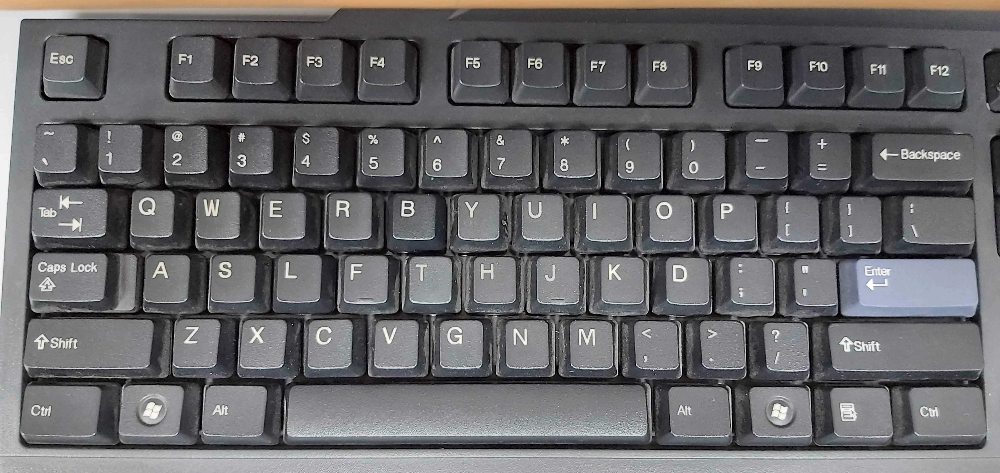

> [!TIP] BlogBlog 同樂會！
> 這是我的「[BlogBlog 同樂會 - 2026 年 7 月](https://blogblog.club/party)」的投稿文章。本月主題是「[有趣的小知識或冷門概念](https://shuaixin.cc/Fun-Fact/)」，由[劉昕](https://shuaixin.cc)主持。如果你有自己的部落格，歡迎一起來參加！

> [!CAUTION] 警告
>
> 本文有部份論點較為激進，擔心閱讀後玻璃心碎滿地者，請自行斟酌是否繼續閱讀。

# 恐龍其實還沒有完全滅絕
鳥類與某些恐龍品種之間的聯繫，其實比另一些恐龍品種之間的聯繫都還要接近。因此恐龍其實還沒有完全滅絕，鳥類是名符其實的現代恐龍。

# 顏色的含義

顏色其實並沒有任何物理含義，它只是生物的一種視覺感受而已。真正有物理含義的，是電磁波的光譜。

HSV/HSL 色彩空間當中的色相（hue）色相環單位是角度，這種色相環的角度也沒有什麼物理意義。大多數人類能感知到的顏色，實際上是一個不規則的曲面立體，色相環是對這種不規則圖形的一種閹割。色度圖（chromaticity diagram）也是個不規則的圖形，上面的 X 軸和 Y 軸也不具備物理意義，它就純粹是個數學工具而已。

「白色」在物理上沒有一個清晰、統一的定義，每個色彩空間都需要自己去定義一個「白點」（white point），所以大家玩攝影時還有白平衡調整這種破事。

# Alex Hsu 實為中共喉舌
Alex 在牠之前一篇文章，發表了其「應以官話打壓並取代一切本土語言」的核心思想。我曾經留言向牠提交補充說明，當時牠的表現還算友善。結果牠沒過幾天就把整個留言系統給揚了。我嘗試寄信給牠表達不滿，迄今未獲任何回覆，與中共實乃一丘之貉，詳請請見《[Alex Hsu 打壓本土語言](/blog/zh/alex-hsu-suppresses-local-languages/)》。

# Eddie Lv 的台灣中心論
Eddie Lv 在他的[部落卷](https://eddielv.com/blogroll/)和[文章](https://eddielv.com/musings/nownownow-com/)當中引用 nownownow.com 的時候，把「繁體中文」和「台灣」直接劃上等號，言下之意就是台灣以外的中文地區，使用的應該都是殘體中文。**Nownownow.com 採用的是地域分類，不是語文分類。** 香港目前還不是完全的殘體中文地區，雖然其實也正在逐漸向祖國靠攏了，這豈不與 Alex 的「大中華共榮圈」有異曲同工之妙？我的出生地和成長地都不在台灣，也不曾在台灣長住過，故這個網站上的文字對於 Eddie 來說，都是殘體中文。

# 虛擬世界論與宗教
如果這個世界真的是被[虛擬](https://zh.wikipedia.org/wiki/%E6%A8%A1%E6%93%AC%E7%90%86%E8%AB%96)出來的話，那麼在這個虛擬世界之外的觀察者，就可以理解為虛擬世界內部的人所解的「神」。這些「神」究竟是有一位還是多位，對於虛擬世界內部的人而言根本無法區分。所以在這個世界內部討論世界到底是一神還是多神是毫無意義的。

也許你會說：「且慢！」，然後說，那是人類難以企及的領域，所以所謂一神或者多神可以看作是人類的藝術加工，然後慢慢形成一種信仰。……

(WIP)

# 「得」的歧義
在現代標準漢語[^1]中，「[得](https://dict.revised.moe.edu.tw/dictView.jsp?ID=1923)」字有好幾個不同的讀音：
- ㄉㄜˊ dé：
    - 表示「能夠」。如「不得」、「得以」。
- ㄉㄟˇ děi：表示「必須」。
- ㄉㄜ de：用於動詞、形容詞後面，表示狀語。

台灣的法律條文很喜歡用「得」字，讀作ㄉㄜˊ dé，表示「能夠」的意思。表「必須」之義時，用「應」。在粵語的書面語讀法中，「得」字的所有義項都唸成同音，於是就產生歧義了（但「得」表「能夠」義很少獨用，通常與「不」連用），是台灣法律用語中一個臭名昭著的大坑。

# 人均林超英
> 熱，但不辛苦。
>
> ——林超英

香港有一位以堅持不開冷氣而著稱的人物，名叫林超英。叉雞有做過一條[影片](https://youtu.be/ws2Rfw7CrHw)講述他的事跡。

根據身邊人的描述[^2]，台灣和大陸的冷氣水平，相較於香港而言都很弱。因此這些地方的人都是人均林超英。（恭喜 [Wiwi](https://wiwi.blog/blog/twenty-fived) 成為例外！）

據說歐洲那邊有很多人寧願熱死也不裝冷氣（直至真的熱死了才想起來這件事），這些人的觀點與上述描述別無二致。

話說回來，冷氣其實是一個難以解開的惡性循環：冷氣將熱量帶到沒有冷氣的地方，從而致使更多的人都不得不打開冷氣。問題的解方只有一個，就是**先解決地球人口過多的問題。**

# 繁體中文鍵盤與中文輸入法

有不少資料均指出香港最多人使用的輸入法是倉頡，在數十年前這也許是正確的，但其實現在已經不太對了。雖然很多中小學直到現在仍然會教倉頡，但事實上已經沒多少人能完全學會了。許多人用的實際上是速成（倉頡的簡化版），甚至是基於官話的漢語拼音和手寫辨識。

在香港賣的繁體中文鍵盤，其實跟台灣的繁體中文鍵盤沒有分別，大部分都有標示~~精靈文~~注音符號。此外還有倉頡和港台都沒什麼人在用的大易。

大易在繁體中文鍵盤上面是個尷尬的存在，它有些鍵名和倉頡的相同但位置不同，容易成倉頡系輸入法初學者的混淆。大易實際的使用人口也極其稀少。與倉頡相比，大易會用到鍵盤上排的數字根（以及旁邊的一些符號鍵）來組字根，範圍跟注音差不多，重碼率卻高出一截。大易選字的方式也比較奇怪，是按你鍵盤上的「號路街鄉鎮」鍵而不是按數字鍵。據說以前台灣有一些專門的打字訓練會用上大易，除此之外基本上沒有人會用。正正是由於使用大易的人太少，有一些中文鍵盤其實已經索性去掉大易字根了（但是留下注音和倉頡，不然就不是中文鍵盤了）。

再往下講，就過於詳細、小眾了。我還是單獨開個[文章分類](/blog/zh/categories/chinese-ime-%E4%B8%AD%E6%96%87%E8%BC%B8%E5%85%A5%E6%B3%95/)吧。

# 其他語言鍵盤

你以為拉丁字母輸入法就只有QWERTY一種？錯了！德語系用的是「QWERTZ」（唯一差別是「Y」和「Z」對調）、法語系用的是「AZERTY」（「A」與「Q」對調、「W」與「Z」對調，右下角的「M」跟一些符號鍵被完全重組）。還有些非主流的鍵盤佈局如 Dvorak，非主流鍵盤佈局往往聲稱其設計更符合人體工學。

以泰文和印度文字為代表的「[婆羅米系文字](https://zh.wikipedia.org/wiki/%E5%A9%86%E7%BD%97%E7%B1%B3%E7%B3%BB%E6%96%87%E5%AD%97)」，由於字母數目太多，本身又不區分大小寫，所以 Shift 鍵被用於選擇字母。

# 農曆節日
日本的許多節日都是從農曆日期直接搬到公曆日期慶祝，所以實際上是前移了一個多月。想當年 1930 年代的國民政府也有試圖命令廢除農曆新年，並模仿日本將新年習俗前移，但這項政策在民間遇到很大阻力，最後政府也是迫於無奈放棄。鬼也想不通這項政策在日本是怎麼被接受的。

# 電梯門的安慰劑按鈕
舊文，詳請[點此](/blog/zh/placebo-button/)。

# 淺談數個漢語方言現象
啊，剛好找到篇舊文，順便也拿來投稿了，詳請[點此](/blog/zh/chinese-dialectal-phenomena/)。

# 關於本站
這個網站的不少界面元素都是從「Wiwi 部落格宇宙」當中別的部落格~~抄~~參考而來的，都是反向工程，全程盡量不依靠 AI，算是我給自己的一個小小挑戰。

[^1]: 「現代標準漢語」是個學術名詞，常見的稱呼有「普通話」、「國語」和「華語」等，但很遺憾地這種語言並不存在一種獲得普遍使用、無歧義、而且能夠使某些政治狂熱份子滿意的稱呼，不管我怎樣稱呼都總會有人不滿意。
[^2]: 我本人因為不喜歡在大夏天外出，所以基本上也沒有在夏季拜訪過這些地方。
